# AWS Streaming Recommender Pipeline

An end-to-end batch and streaming data pipeline that trains a recommender system on user-product ratings, stores model embeddings in a vector database, and serves real-time product recommendations from live user activity.


---

## Overview

This project implements a full recommender-system data pipeline in three stages: a **batch pipeline** that prepares training data from transactional ratings data, a **vector database** that stores model-generated embeddings for fast similarity search, and a **streaming pipeline** that consumes live user activity and serves real-time product recommendations.

The architecture translates a stakeholder requirement — "recommend products to users based on their behavior" — into a working system spanning ETL, ML artifact storage, vector search, and event-driven inference.

**Stack:** AWS RDS (MySQL), AWS Glue, Amazon S3, AWS RDS PostgreSQL + pgvector, AWS Lambda, Amazon Kinesis Data Streams, Amazon Kinesis Data Firehose, Terraform

---

## Architecture

### Batch pipeline — preparing training data

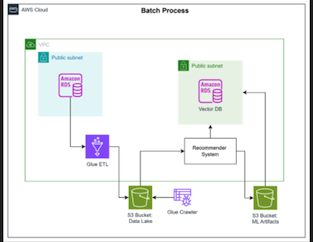

User ratings (`customerNumber`, `productCode`, `productRating`) are stored in an RDS MySQL source database alongside the existing transactional schema. An AWS Glue ETL job extracts and transforms this data, joining it with product attributes, and writes the result to an S3 data lake partitioned by `customerNumber` — ready for the ML team to train a recommender model.

### Streaming pipeline — real-time inference

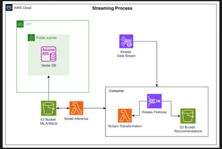

Live user activity flows through Kinesis Data Streams into Kinesis Data Firehose, which invokes a Lambda function to extract features, perform inference using the trained model and vector embeddings, and deliver the resulting recommendations into a partitioned S3 bucket.

All infrastructure (Glue job, S3 buckets, RDS vector database, Lambda functions, Kinesis Firehose) was provisioned using Terraform.

---

## 1. Batch Pipeline — Training Data Preparation

Explored the source `ratings` table (1–5 scale ratings per customer/product) in the RDS MySQL database, then ran a Glue ETL job to transform and load it into the S3 data lake.

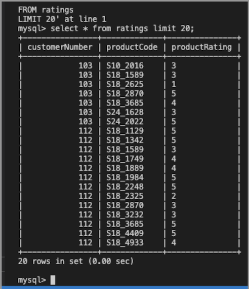
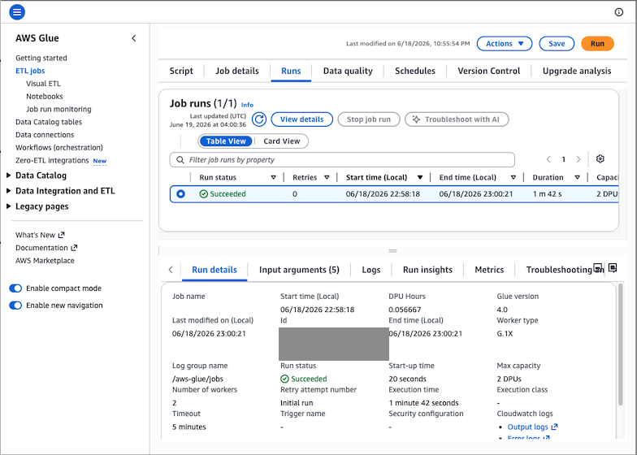

**Output schema** after transformation — ratings joined with customer and product attributes into a single flat training table:

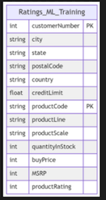

**Result:** Transformed data landed in S3 partitioned by `customerNumber`, allowing the ML team to efficiently query training data per user.

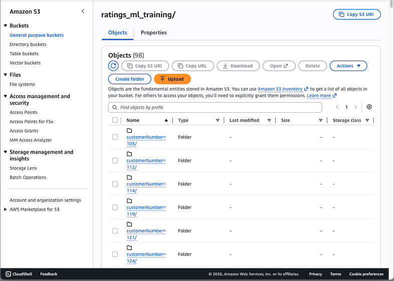

---

## 2. Vector Database — Storing Model Embeddings

A trained recommender model (provided as `best_model.pth`, alongside preprocessing scalers and one-hot encoders) produced item and user embeddings, published to an S3 "ML Artifacts" bucket.

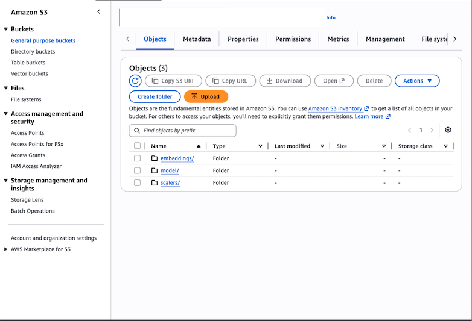
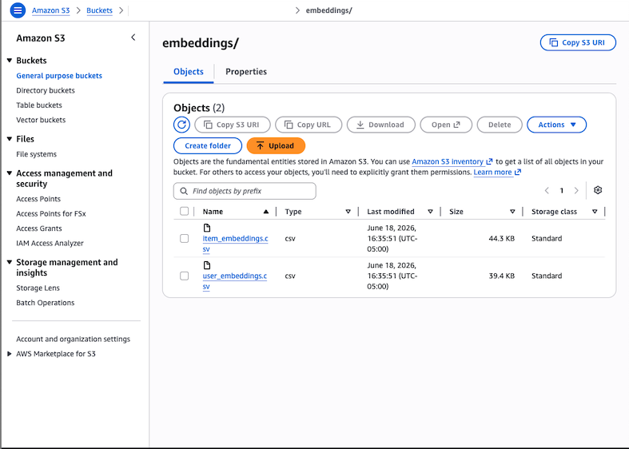

**Why PostgreSQL + pgvector:** The vector database was provisioned as an RDS PostgreSQL instance with the `pgvector` extension rather than a standard relational store. pgvector adds native vector data types and similarity-search indexing (e.g., L2 distance via `<->`, cosine distance via `<=>`), which allows efficient approximate nearest-neighbor search over high-dimensional embeddings — something a standard B-tree-indexed table cannot do efficiently at scale. This is the same retrieval pattern that underlies retrieval-augmented generation (RAG) systems in LLM applications, just applied here to product recommendations instead of text chunks.

Loaded the embeddings into the vector database via SQL import from S3:

```
109 rows imported into relation "item_emb" from item_embeddings.csv
98 rows imported into relation "user_emb" from user_embeddings.csv
```

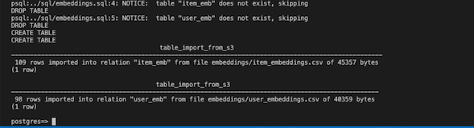
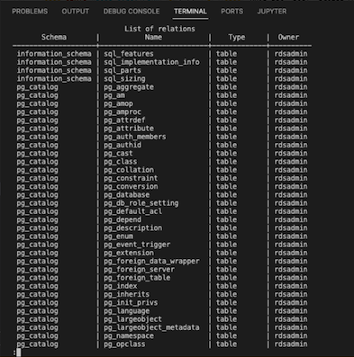

*Note: this is lab-scale data (109 item embeddings, 98 user embeddings) — sized for demonstrating the pipeline mechanics, not production volume.*

---

## 3. Streaming Pipeline — Real-Time Recommendations

Configured a pre-built `model-inference` Lambda function with the vector database connection details (host, username, password — sourced from Terraform-managed outputs, never hardcoded), then deployed the streaming infrastructure: Kinesis Data Firehose, a `stream-transformation` Lambda, and a partitioned S3 recommendations bucket.

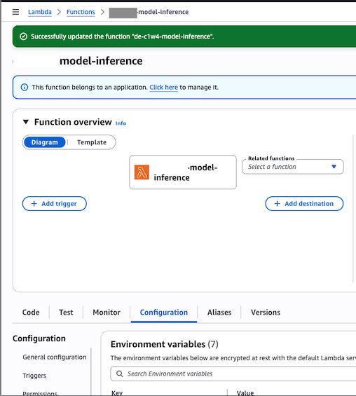

**How retrieval works conceptually:** Kinesis Data Streams receives simulated user activity events. Firehose invokes the transformation Lambda to extract user/product features from each event, which are passed to the model-inference Lambda. That function computes a query embedding and performs a nearest-neighbor similarity search against the `item_emb` table in the vector database to retrieve the closest-matching products, before Firehose writes the resulting recommendations to S3.

**Result:** Lambda invocations completed successfully with zero errors across the monitored window.

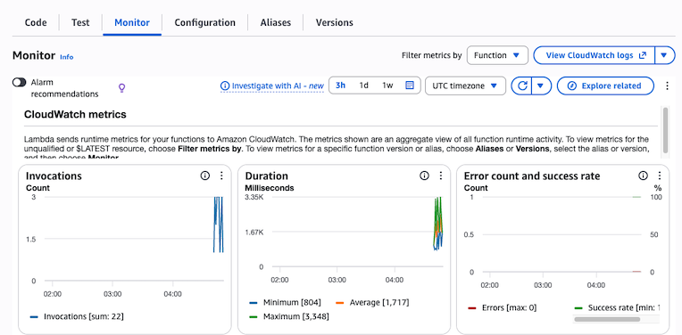

Recommendations landed in S3, partitioned by year/month/day/hour:

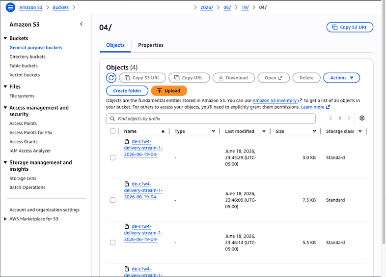

---

## What I'd Build Next

- Inspect and document the actual SQL/embedding-retrieval logic inside the inference Lambda (lab session expired before I could pull this — next priority if I revisit the environment)
- Add a CloudWatch Alarm on Lambda error rate and Firehose delivery failures, rather than relying on manual monitoring
- Replace the simulated Kinesis event generator with a realistic load pattern to validate throughput under higher concurrency
- Extend the embedding similarity search into a small RAG-style prototype — using the same pgvector retrieval pattern to power natural-language product Q&A instead of pure recommendation scoring
- Move the manually-edited Lambda environment variables into Terraform-managed configuration for full IaC coverage

---

## Context

Completed as part of the **DeepLearning.AI Data Engineering Professional Certificate**, "Building End-to-End Batch and Streaming Pipelines Based on Stakeholder Requirements." Infrastructure modules (Terraform configs, Lambda function code, source database) were pre-provisioned; pipeline execution, vector database setup, embeddings load, Lambda configuration, and the architectural analysis above were performed independently.
